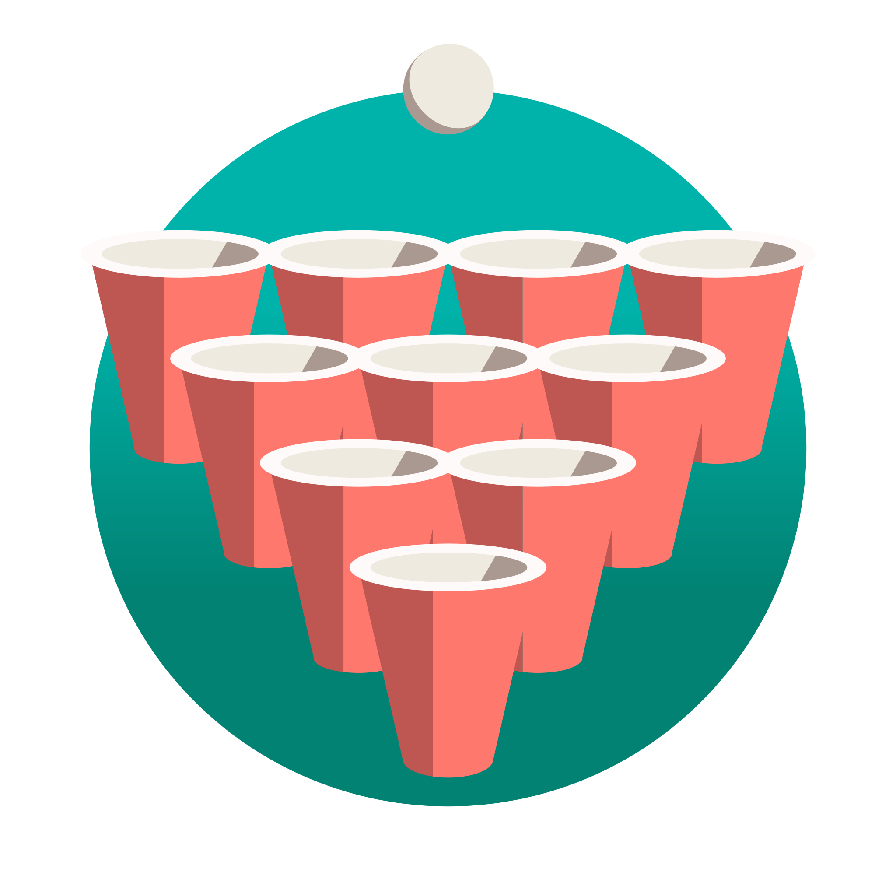

    

# Bierpongregeln / Beer Pong Rules

A comprehensive web application for Beer Pong rules, tournament results, and live tournament management. This project is designed to be the definitive resource for both casual players and serious tournament organizers.

## Table of Contents

- [Bierpongregeln / Beer Pong Rules](#bierpongregeln--beer-pong-rules)
  - [Table of Contents](#table-of-contents)
  - [Project Overview](#project-overview)
  - [Key Features](#key-features)
  - [Technology Stack](#technology-stack)
  - [Development Roadmap \& TODOs](#development-roadmap--todos)
    - [Phase 1: Foundation (Minimum Viable Product)](#phase-1-foundation-minimum-viable-product)
    - [Phase 2: Dynamic Application](#phase-2-dynamic-application)
    - [Phase 3: Live Platform](#phase-3-live-platform)
  - [License](#license)

## Project Overview

"Bierpongregeln" is being developed in three distinct phases, evolving from a static information portal into a fully interactive, real-time tournament platform.

- **Phase 1 (Foundation)**: Establish a performant, static website to serve as a central repository for various Beer Pong rulesets and to display historical tournament results.
- **Phase 2 (Dynamic Application)**: Transition the project to a dynamic web application powered by a database. This phase introduces interactive tools and a more robust data management system.
- **Phase 3 (Live Platform)**: Implement user authentication and real-time features, allowing users to create, manage, and follow live tournaments directly on the platform.

## Key Features

- **Ruleset Database**: A comprehensive collection of official and custom Beer Pong rules.
- **Tournament Archives**: A searchable and sortable database of past tournament results and statistics.
- **Tournament Format Generator**: An interactive tool to help organizers plan tournaments by calculating match counts and rounds for various formats (e.g., Single Elimination, Round Robin).
- **Live Tournament Hosting**: Functionality for users to create, manage brackets, and update scores in real-time.
- **Internationalization (i18n)**: Support for multiple languages to cater to a global audience.

## Technology Stack

This project utilizes a modern, full-stack TypeScript-based architecture.

- Framework: Next.js (React)
- Styling: Tailwind CSS
- Backend & API: Next.js API Routes
- Database: PostgreSQL
- ORM: Prisma
- Authentication: NextAuth.js
- Real-time Communication: WebSockets (via Pusher, Ably, or similar)
- Localization: next-i18next / next-intl
- Deployment: Vercel

> [!NOTE]
> As of now, the project is in its initial phase with a static website. The dynamic application and live tournament features are planned for future development. Therefore, all planned technologies are not finalized yet and may change as the project evolves.

## Development Roadmap & TODOs

This section tracks the project's progress. Items will be checked off as they are completed.

### Phase 1: Foundation (Minimum Viable Product)

- [ ] Core Project Setup

  - [ ] Initialize Next.js project with TypeScript and Tailwind CSS.
  - [ ] Establish project structure and code conventions.

- [ ] Static Content Implementation

  - [ ] Define initial data structure using local Markdown/JSON for rules and tournaments.
  - [ ] Create a list page to display all available rulesets.
  - [ ] Create a dynamic detail page for rendering individual rulesets from Markdown.
  - [ ] Implement a results page with a sortable table for past tournaments.

- [ ] Deployment

  - [ ] Configure and deploy the initial static site to Vercel.
  - [ ] Set up a CI/CD pipeline for automatic deployments.

### Phase 2: Dynamic Application

- [ ] Backend & Database Integration

  - [ ] Design the database schema using the Prisma schema language.
  - [ ] Set up a PostgreSQL database instance.
  - [ ] Run initial database migrations.
  - [ ] Write a script to migrate data from local files to the database.

- [ ] API Development

  - [ ] Create API endpoints for fetching rulesets (/api/rulesets).
  - [ ] Create API endpoints for fetching tournaments and results (/api/tournaments).
  - [ ] Frontend Refactoring
  - [ ] Convert static pages (getStaticProps) to dynamic pages that fetch data from the API (getServerSideProps or client-side SWR/React Query).

- [ ] New Feature Implementation

  - [ ] Develop the UI for the Tournament Format Generator.
  - [ ] Implement the logic for calculating format statistics on the client-side.
  - [ ] Integrate a localization library (e.g., next-i18next).
  - [ ] Create initial translation files (e.g., for German and English).
  - [ ] Refactor UI components to use the localization framework.

### Phase 3: Live Platform

- [ ] User Authentication

  - [ ] Integrate NextAuth.js into the application.
  - [ ] Add User model to the Prisma schema and link to Tournament.
  - [ ] Implement registration and login flows.
  - [ ] Create protected routes and components accessible only to authenticated users.

- [ ] Tournament Management

  - [ ] Design and build a form for creating and configuring new tournaments.
  - [ ] Create API endpoints to handle tournament creation and updates.
  - [ ] Develop a dedicated dashboard for organizers to manage tournament brackets and player lists.

- [ ] Real-time Functionality

  - [ ] Integrate a WebSocket service for real-time communication.
  - [ ] Implement backend logic to push updates (e.g., score changes) to clients.
  - [ ] Implement frontend logic to subscribe to and display real-time updates on public tournament pages.

## License

This project is licensed under the GNU General Public License v3.0. See the [LICENSE](LICENSE) file for more details.
