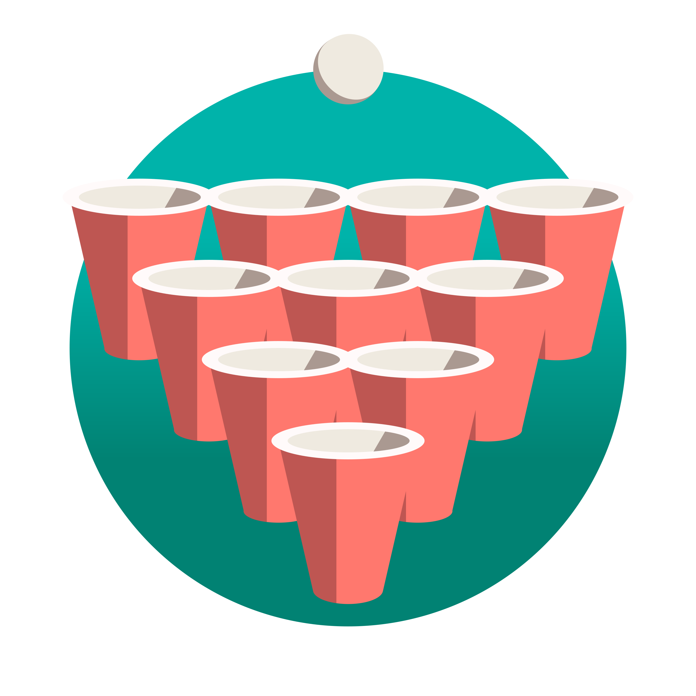

    

# Bierpongregeln / Beer pong rules

This is a collection of rulesets for beer pong that is built using [Docusaurus 2](https://docusaurus.io/) and served with GitHub Pages.

## How to run locally

1. Run `npm install` to get the dependencies.
2. Run `npm run start` in the root directory of this repository.

### Build for production

1. Run `npm install` to get the dependencies.
2. Run `npm run build` to build for production.
3. Run `npm run serve` to test your build locally.

## Developing the leaderboard plugin

1. Run `npm install` to install the dependencies.
2. Use the [VSCode ESLint plugin](https://marketplace.visualstudio.com/items?itemName=dbaeumer.vscode-eslint) to get linting errors in the editor.
3. Run `npm run lint` to lint the code.
4. Run `npm run validate-json` to validate the tournament data against the schema.

## Developing the spellchecker

1. Run `pip install -r pages_spellchecker/requirements.txt` to install the dependencies.
2. Run `python pages_spellchecker/pages_spellchecker.py` to check the spelling of the pages.
