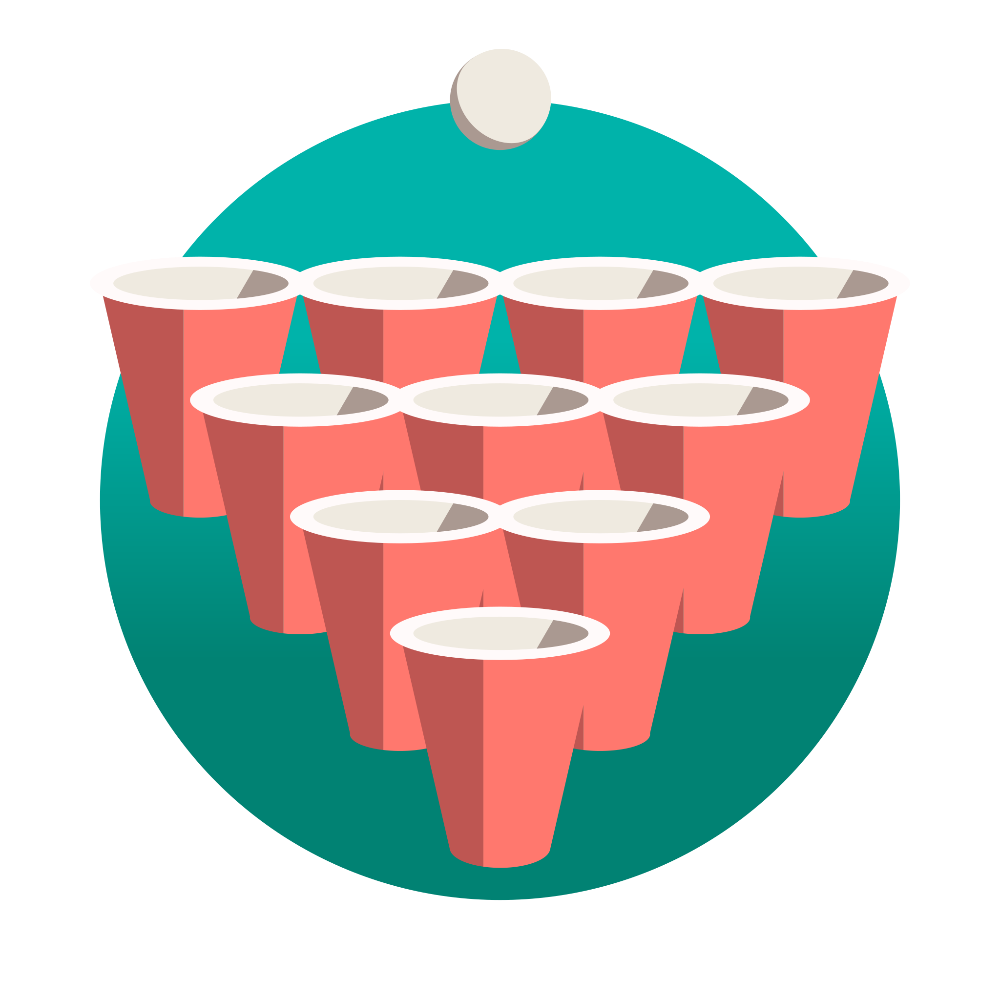

    

# Bierpongregeln

    
    
    

---

A public website for beer pong rules and tournament tools.

## Features

- **Ruleset browser** — Browse 9 beer pong rule variants (flavors), from the base ruleset to community-specific ones
- **Tournament results** — Sortable table of historical tournament results and standings
- **Tournament format generator** — Enter player count and team size to calculate the number of tables, rounds, and suggested formats (Free For All, Group Phase, Swiss System)

## Tech Stack

| Category             | Technology                  |
|----------------------|-----------------------------|
| Framework            | Next.js (React, TypeScript) |
| Styling              | Tailwind CSS                |
| Linting & Formatting | Biome                       |
| Package manager      | pnpm                        |
| Deployment           | Vercel                      |

## Contributing

Contributions are welcome! Please read the [contributing guidelines](CONTRIBUTING.md) before submitting issues or pull requests.

Available issue templates: [Bug report](.github/ISSUE_TEMPLATE/bug.yml) · [Feature request](.github/ISSUE_TEMPLATE/feature.yml) · [Enhancement](.github/ISSUE_TEMPLATE/enhancement.yml) · [Refactor](.github/ISSUE_TEMPLATE/refactor.yml) · [General](.github/ISSUE_TEMPLATE/general.yml)

## License

This project is licensed under the GNU General Public License v3.0. See the [LICENSE](LICENSE) file for details.
